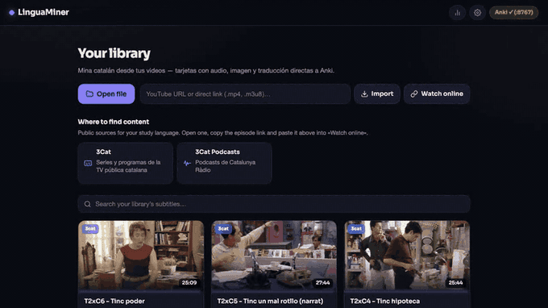
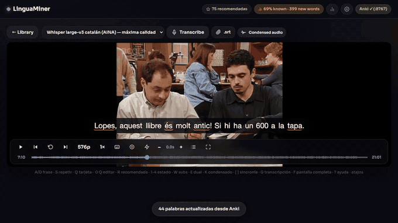
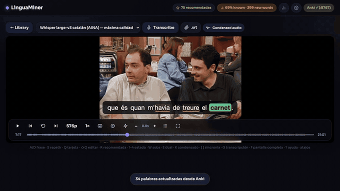
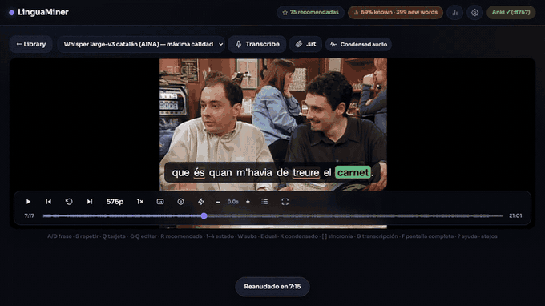
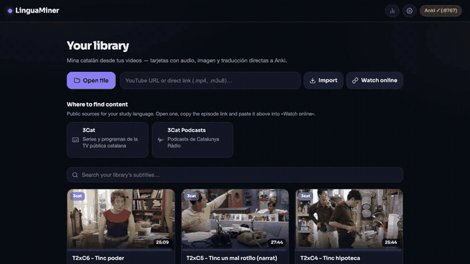

# How to use LinguaMiner

A walkthrough of everything the app does, in the order you'll meet it. Each
section has a clip, so you can skim the pictures and only read what you need.

**Prefer video?** The same tour, narrated, in three minutes:
[youtu.be/_Iu7WcnNXAo](https://youtu.be/_Iu7WcnNXAo)

Haven't installed it yet? Start with the
[step-by-step install guide](install-guide.md), then come back.

- [1. Getting a video in](#1-getting-a-video-in)
- [2. Getting subtitles](#2-getting-subtitles)
- [3. Reading the colours](#3-reading-the-colours)
- [4. Making a card](#4-making-a-card)
- [5. Jumping around with the transcript](#5-jumping-around-with-the-transcript)
- [6. The words panel and your level](#6-the-words-panel-and-your-level)
- [7. Condensed audio](#7-condensed-audio)
- [8. Bringing in words you already know](#8-bringing-in-words-you-already-know)
- [9. Settings worth knowing](#9-settings-worth-knowing)
- [10. Keyboard shortcuts](#10-keyboard-shortcuts)

---

## 1. Getting a video in

Three ways, all from the front page:

**Open file** takes an mp4, mkv, mp3 or a subtitle file from your disk.

**Watch online** takes a YouTube link, a direct `.mp4`, or an HLS `.m3u8`
stream. Nothing is downloaded — it plays straight from the source and the
cards cut the audio and the frame out of the stream. This is the fastest way
to try the app.

**Import** downloads the video first, with a progress bar. Use it when you want
offline HD, or when the stream is flaky.

Under those buttons there's a **Where to find content** section listing public
broadcasters for whatever language you're studying — Catalan gets 3Cat,
Portuguese gets RTP, Italian gets RaiPlay. Open one, copy an episode link,
paste it into *Watch online*.

Podcasts and radio work too. Audio-only sources become normal sessions; you
just get no video frame on the card.

## 2. Getting subtitles

If the video already has subtitles, LinguaMiner uses them and you can start
mining immediately. The card on the library page tells you where they came
from — YouTube subs, YouTube auto-captions, your own `.srt`, or nothing yet.

If there are none, or the ones you got are rubbish, hit **Transcribe**.

- Pick **small** for a quick test. It's noticeably worse but finishes fast.
- **large-v3** is the good one. Catalan additionally gets a fine-tuned model.
- The first run downloads the model (~3 GB). After that it's local.

**Transcribing replaces whatever subtitles were there.** That's deliberate — if
the auto-captions are useless, you don't have to delete the video and start
over. Your word statuses are stored per word, not per subtitle file, so
re-transcribing never costs you vocabulary you'd already marked.

> **It looks stuck.** On a 50-minute episode, several minutes pass before the
> percentage moves — that's the model loading and the voice detection pass.
> Press Transcribe **once** and let it work. Pressing it repeatedly used to
> start extra jobs that fought each other for the CPU; the app now refuses,
> but patience is still the right move.

You can also attach your own `.srt` at any time with the paperclip button,
which is what you want when you find a better subtitle file than the site ships.

## 3. Reading the colours

Every word in the subtitle is coloured by what you know:

| Look | Meaning |
|---|---|
| red underline | new — you've never marked this word |
| orange underline | learning — it's in Anki but not mature yet |
| no mark | known |
| grey | ignored — you told the app to stop asking |
| **filled block** | **recommended: mine this one** |

The filled block is the part worth understanding. A word gets highlighted only
when three things are true at once: you don't know it, it's **frequent enough
to be worth your time**, and it's **not a proper noun**.

That last rule matters more than it sounds. Frequency data will happily tell
you that a character's name is one of the most common words in the show — true,
and useless. The version of this feature that only checked "one unknown word in
the sentence" spent its time recommending names.

How frequent counts as frequent enough follows your own level. Set it under
⚙️ → *Recommended words*, from **Very frequent** (only the highest-value words)
down to **All but names**. Start strict and loosen it as your vocabulary grows.

The header chip shows what percentage of the whole video you already know, plus
how many new words are left.

## 4. Making a card

Click any word. You get a popup with the dictionary entry, how common the word
is, its part of speech, the sentence translated, and example sentences from
other videos in your own library.

From there:

- **⏎** sends the card straight to Anki.
- **⇧Q** or the pencil opens the editor first, if you want to fix a field.
- The **1–4** keys set the word's status without making a card, for when you
  realise you already know it.
- Drag across several words to mine a whole expression instead of one word.

The card arrives in Anki with the audio of that sentence cut out by ffmpeg, a
frame from the video, the sentence, the translation, and the word's lemma and
part of speech.

**If Anki is closed, nothing is lost.** Cards queue up locally and send
themselves the next time the app sees Anki running.

## 5. Jumping around with the transcript

Press **G** for the full transcript in a side panel. Click any line to jump
straight there. Lines with a recommended word are marked, so you can scroll and
pick the worthwhile ones instead of watching linearly.

**R** jumps to the next recommended sentence directly, which is the fastest way
to mine an episode you've already watched.

Other movement: **A** and **D** step back and forward one sentence, **S**
replays the current one, **P** auto-pauses at the end of each line.

## 6. The words panel and your level

The **Words** tab lists every word in the video, grouped by how common it is in
the language — rank 1–100, 101–300, and so on.

Left-click a word for its dictionary entry. Right-click flips it between known
and new.

**Set vocabulary level** is the big one for a new user. It marks the N most
frequent words of the language as known in one go, so the app stops
highlighting *the*, *and* and *because* on day one. Pick the band that matches
roughly where you are and adjust later.

## 7. Condensed audio

**Condensed audio** exports an MP3 containing only the dialogue of an episode,
with the silence and the music cut out. A 50-minute show usually lands around
20 minutes.

It's for passive listening — headphones on the way to work, second pass through
material you've already mined. You need a transcript first, since that's what
tells the app where the speech is.

There's also a **K** toggle in the player that does the same thing live: it
skips the gaps between lines while you watch.

## 8. Bringing in words you already know

If you already study this language in Anki, don't start from zero. Go to ⚙️ →
*Vocabulary you already know*, pick one of your decks, and the app marks those
words as known.

It reads the first field of each note, strips the HTML and audio tags, and
skips anything that looks like a sentence rather than a word. **It never
overwrites a status you set yourself** — it only fills in blanks.

After that, word states also keep syncing from your Anki review intervals, so a
word you've matured stops being highlighted in the video without you doing
anything.

## 9. Settings worth knowing

**Interface language** follows your system by default. English, Spanish and
Catalan are available.

**Study language** is what you're learning. Each one downloads its own
translator, dictionary and voice the first time you pick it. If yours is
missing, see [adding a language](adding-a-language.md).

**Translate to** is the language on the back of your cards. English or Spanish,
depending on what the study language supports. Russian is English-only, because
no Russian→Spanish model exists.

**Recommended words** is the frequency threshold from section 3.

**Share mode** serves the app to your local network or your Tailscale, so your
phone or a friend can use it in a browser. It's off by default and gives
whoever connects full access, so only turn it on for people you trust.

**Updates** pulls the latest version without touching a terminal.

## 10. Keyboard shortcuts

Migaku's layout, all remappable in ⚙️.

| Key | Does |
|---|---|
| `A` / `←` | previous sentence |
| `D` / `→` | next sentence |
| `S` / `↓` | replay this sentence |
| `Q` | mine the word under the cursor |
| `⇧Q` | open the card editor |
| `1`–`4` | set word status |
| `R` | jump to the next recommended sentence |
| `W` | hide subtitles |
| `E` | dual subtitles |
| `K` | condensed playback |
| `G` | transcript panel |
| `P` | auto-pause each line |
| `F` | fullscreen |
| `space` | play / pause |
| `[` `]` | nudge subtitle timing |
| `⏎` | send the card |
| `Esc` | close whatever's open |
| `?` | this list, in the app |

---

Something unclear, or the app does something this page doesn't explain?
[Open an issue](https://github.com/thecopybookhare-cmd/lingua-miner/issues) —
gaps in this guide are bugs too.
